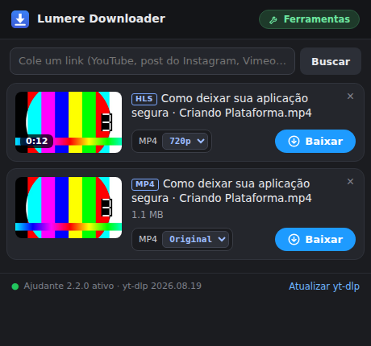
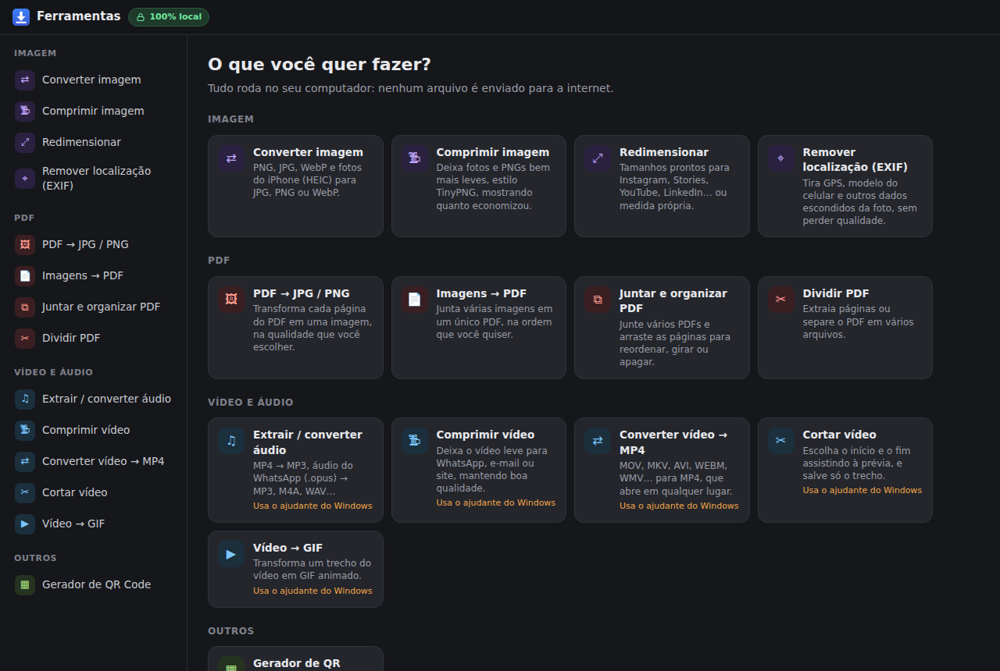

# Lumere Downloader

Extensão para o Google Chrome que **baixa vídeos sem limite** e traz um **painel de ferramentas** de imagem, PDF, vídeo e QR Code. Tudo roda no seu computador; nenhum arquivo é enviado para a internet.

  

## ⬇️ Baixar

**[Baixar a versão mais recente (.zip)](https://github.com/lumeremarketing-lab/lumere-downloader/releases/latest/download/lumere-downloader.zip)**

Esse link sempre baixa a última versão. Quando sair uma versão nova, a própria extensão avisa no popup.

## O que ela faz

**Downloader**
- Detecta sozinha os vídeos que estão tocando na página: MP4, WebM, streams **HLS (.m3u8)** e **DASH (.mpd)**, com escolha de qualidade.
- Funciona em players protegidos que dão erro 403 (ex.: Bunny Stream), porque usa os mesmos cabeçalhos do player.
- **YouTube e +1000 sites:** cole o link e escolha a qualidade (até 4K) ou só o áudio em MP3.
- **Instagram:** cole o link de um post, reel ou carrossel. Aparecem todas as fotos e vídeos, e você escolhe quais baixar.
- Fila de downloads com barra de progresso, cancelar e "Mostrar na pasta".

**Ferramentas** (abrem no painel lateral do Chrome)

  

| Categoria | Ferramentas |
|---|---|
| Imagem | Converter (PNG, JPG, WebP, HEIC do iPhone) · Comprimir · Redimensionar (Instagram, Stories, YouTube, LinkedIn…) · Remover localização/EXIF |
| PDF | PDF → JPG/PNG · Imagens → PDF · Juntar e organizar páginas · Dividir |
| Vídeo e áudio* | MP4 → MP3 (e .opus do WhatsApp) · Comprimir vídeo · Converter para MP4 · Cortar · Vídeo → GIF |
| Outros | QR Code de link, texto, WhatsApp ou Wi-Fi (PNG/SVG) |

\* YouTube, Instagram e as ferramentas de vídeo e áudio usam o **ajudante do Windows** (passo 2 abaixo).

## Instalação (Windows)

O zip tem duas pastas: `extensao` e `ajudante-windows`.

### 1. Extensão (2 minutos)
1. Descompacte o zip numa pasta **fixa**, por exemplo `Documentos\lumere-downloader`. Não apague essa pasta depois, porque o Chrome carrega a extensão direto dela.
2. No Chrome, abra `chrome://extensions`.
3. Ligue o **Modo do desenvolvedor**, no canto superior direito.
4. Clique em **Carregar sem compactação** e escolha a pasta **`extensao`**.
5. Clique no ícone de quebra-cabeça da barra do Chrome e fixe o **Lumere Downloader**.

### 2. Ajudante do Windows (para YouTube, Instagram e vídeo/áudio)
1. Abra a pasta **`ajudante-windows`** e dê dois cliques em **`instalar.bat`**.
2. Se aparecer "O Windows protegeu o computador", clique em *Mais informações → Executar assim mesmo*.
3. Espere a mensagem **"Pronto!"**. O instalador baixa yt-dlp, gallery-dl, ffmpeg e Deno, todos de código aberto e das fontes oficiais.
4. Feche e abra o Chrome. O rodapé do popup deve mostrar **"Ajudante ativo"** com uma bolinha verde.

O ajudante fica em `%LOCALAPPDATA%\MeuVideoDownloader` e não precisa de administrador. Para remover, use o `desinstalar.bat`.

## Atualizar

Quando o popup mostrar **"Nova versão disponível"**:
1. Baixe o zip novo pelo link acima.
2. Substitua os arquivos da sua pasta `extensao` pelos novos.
3. Em `chrome://extensions`, clique em recarregar (↻) no card da extensão.
4. Se o changelog disser que o ajudante mudou, rode o `instalar.bat` de novo.

Se o YouTube ou o Instagram pararem de funcionar, clique em **Atualizar yt-dlp** no rodapé do popup ou rode o `instalar.bat` de novo.

## Problemas comuns

| Problema | Solução |
|---|---|
| "Ajudante não instalado" | Rode o `instalar.bat` e reabra o Chrome |
| Instagram pede login | Entre no Instagram nesse mesmo Chrome |
| Aviso amarelo sobre o gallery-dl no instalador | Instale o [Visual C++ Redistributable (x86)](https://aka.ms/vs/17/release/vc_redist.x86.exe) e rode o instalador de novo |
| "Vídeo criptografado / DRM" | Netflix, Prime, Disney+ etc. não são suportados |
| O Chrome mostra aviso sobre extensões no modo desenvolvedor | É normal para extensões instaladas fora da loja. Clique em manter |

## Privacidade

- Imagem, PDF e QR Code são processados dentro do Chrome. Vídeo e áudio são processados pelo ajudante, no seu PC.
- Os cookies do Instagram vão só para o ajudante local, num arquivo temporário apagado logo depois. Nada é enviado a servidores da Lumere ou de terceiros.
- A extensão consulta só a página de Releases deste repositório, para avisar sobre versões novas.

## Uso responsável

Use para conteúdo que você tem direito de baixar: o seu próprio, conteúdo com licença livre ou com autorização do autor. Respeite os termos de uso de cada site.

## Código aberto usado

[yt-dlp](https://github.com/yt-dlp/yt-dlp) · [gallery-dl](https://codeberg.org/mikf/gallery-dl) · [FFmpeg](https://ffmpeg.org) · [Deno](https://deno.com) · [mux.js](https://github.com/videojs/mux.js) · [PDF.js](https://mozilla.github.io/pdf.js/) · [pdf-lib](https://pdf-lib.js.org) · [JSZip](https://stuk.github.io/jszip/) · [UPNG.js](https://github.com/photopea/UPNG.js) · [qrcode-generator](https://github.com/kazuhikoarase/qrcode-generator) · [heic-to](https://github.com/hoppergee/heic-to). As licenças estão em [`extensao/lib/LICENCAS.txt`](extensao/lib/LICENCAS.txt).

---

Feito por **Lumere**. Licença [MIT](LICENSE).
